<div align="center">

# DAS Procurement Agent

### Внутренняя цифровая служба снабжения: от проекта до проверяемого выбора поставщика

[](https://github.com/ZhanibekDD/DAS-Procurement-Agent/actions/workflows/test.yml)


**Проекты · Поставщики · Запросы КП · Сравнение цен · Документы · AI-разбор · Аудит**

</div>

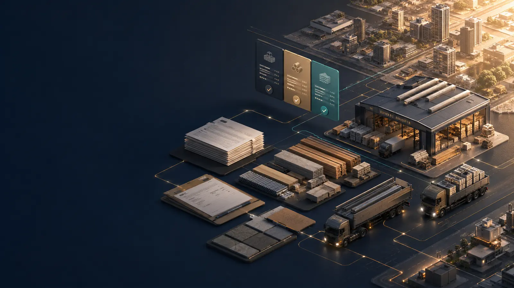

## О продукте

DAS Procurement Agent превращает закупку из переписки, разрозненных файлов и ручных
таблиц в единый контролируемый процесс. Компания загружает проект, счета, прошлые
тендеры и базу контрагентов. Агент выделяет закупочные позиции, помогает сформировать
лоты, подбирает поставщиков, готовит персональные запросы КП и собирает сравнение по
полной стоимости, срокам и условиям.

Система спроектирована как **внутренний контур компании**: ИИ предлагает и ускоряет,
но не выбирает победителя, не отправляет сообщения и не создаёт заказ без решения
ответственного сотрудника.

## Как выглядит система

### 1. Центр снабжения

Общая картина по проектам, активным лотам, полученным КП, документам и экономическому
эффекту. На экране сразу видно, где требуется действие человека.

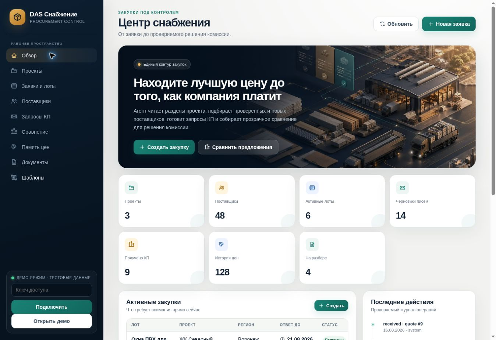

<table>
  <tr>
    <td width="50%"><b>2. Проекты</b><br><sub>Объекты, регионы, адреса поставки и разделы проекта.</sub><br><br>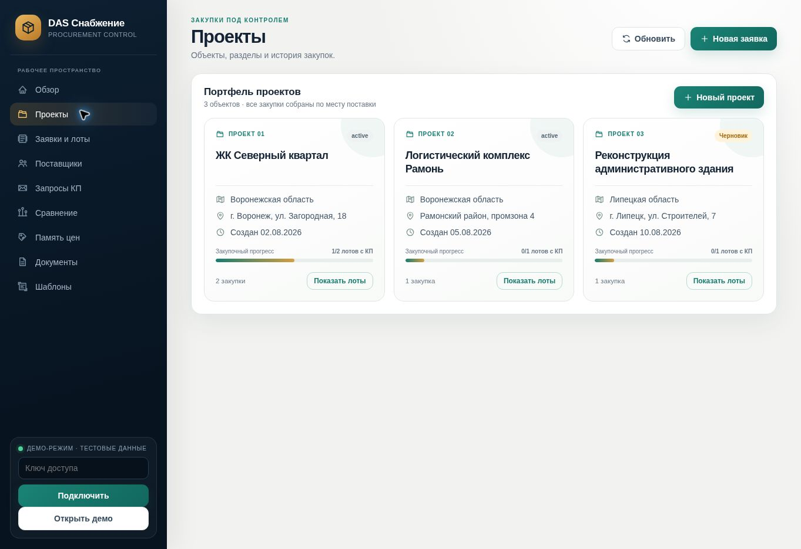</td>
    <td width="50%"><b>3. Заявки и лоты</b><br><sub>Спецификации, сроки ответа, статусы и быстрый переход в тендер.</sub><br><br>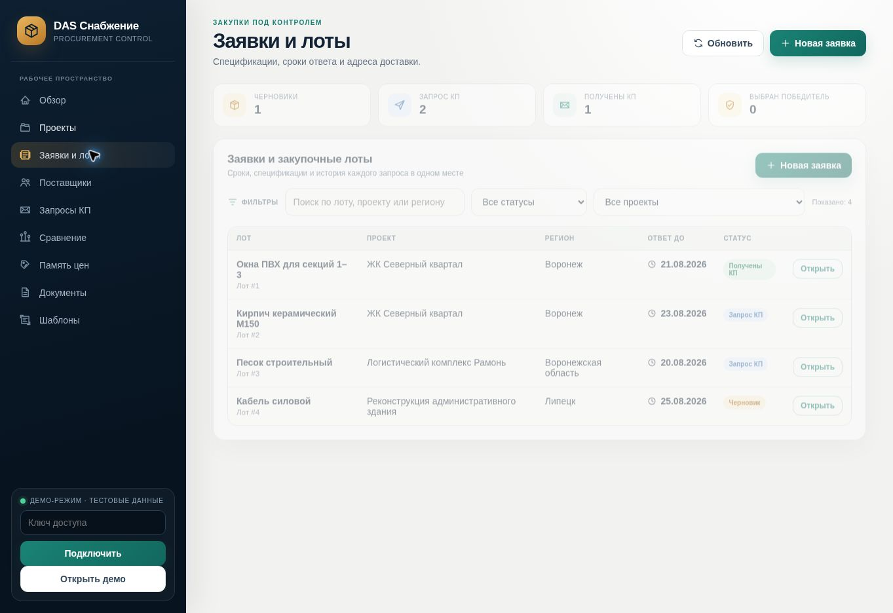</td>
  </tr>
  <tr>
    <td width="50%"><b>4. Карточка тендера</b><br><sub>Спецификация, поставщики, запросы и решение в одном рабочем пространстве.</sub><br><br>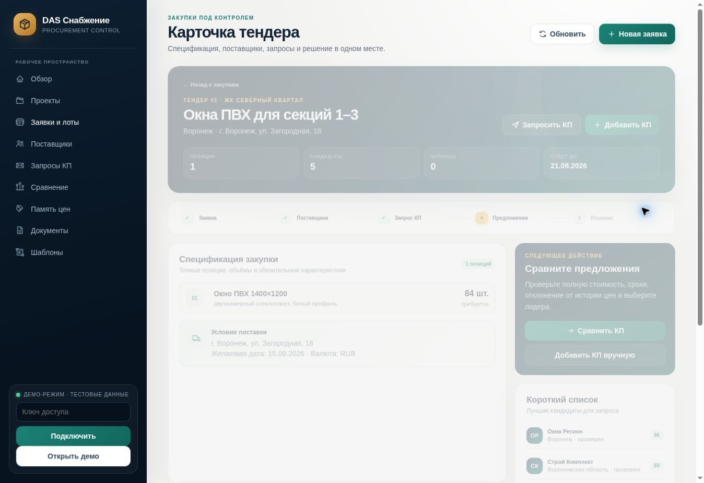</td>
    <td width="50%"><b>5. Поставщики</b><br><sub>Проверенные контрагенты и кандидаты из интернета с рейтингом и категориями.</sub><br><br>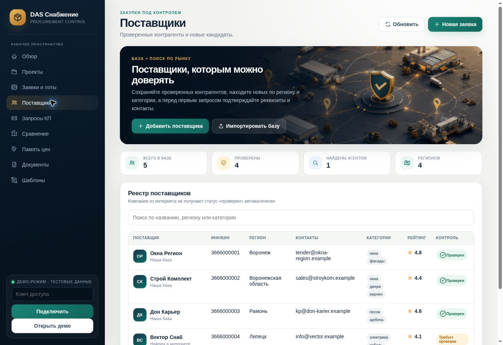</td>
  </tr>
  <tr>
    <td width="50%"><b>6. Запросы КП</b><br><sub>Персональные черновики для email и мессенджеров с обязательным согласованием.</sub><br><br>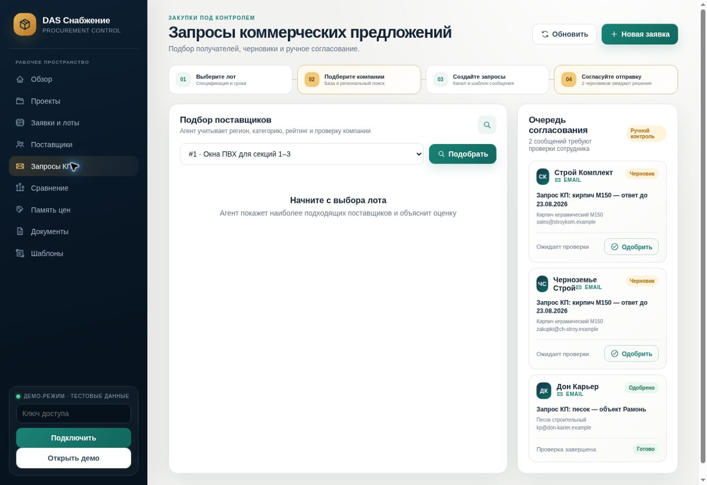</td>
    <td width="50%"><b>7. Сравнение</b><br><sub>Полная стоимость, доставка, сроки, соответствие и прозрачный рейтинг.</sub><br><br>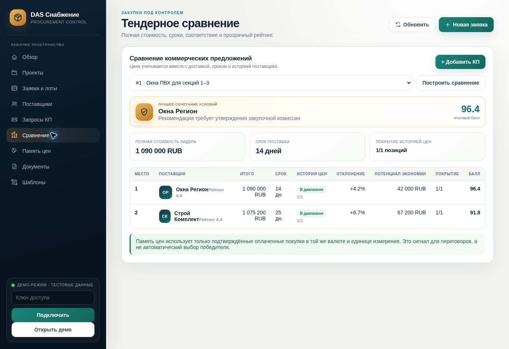</td>
  </tr>
  <tr>
    <td width="50%"><b>8. Память цен</b><br><sub>Сравнение новых предложений с фактически оплаченными закупками.</sub><br><br>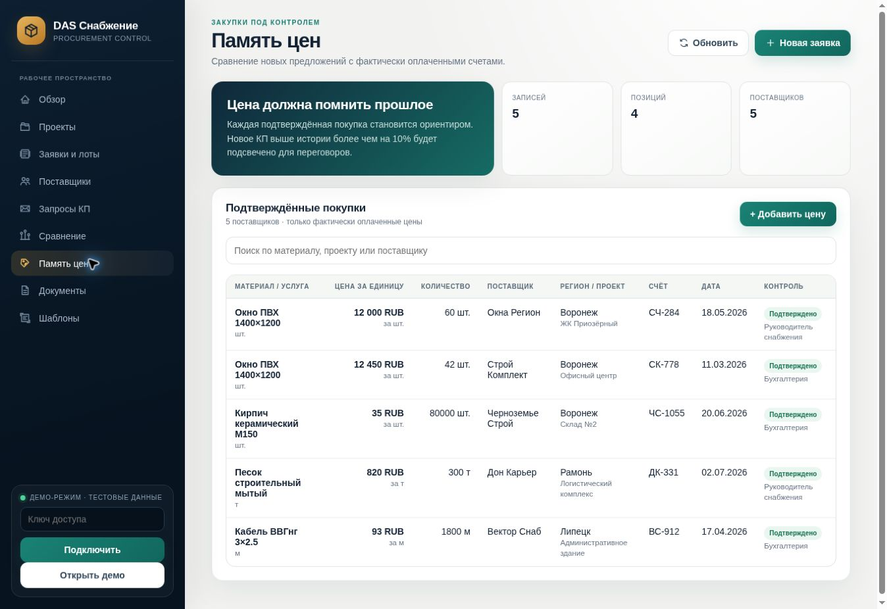</td>
    <td width="50%"><b>9. Документы и AI-разбор</b><br><sub>Найденные позиции, источник, уверенность и ручное создание лота.</sub><br><br>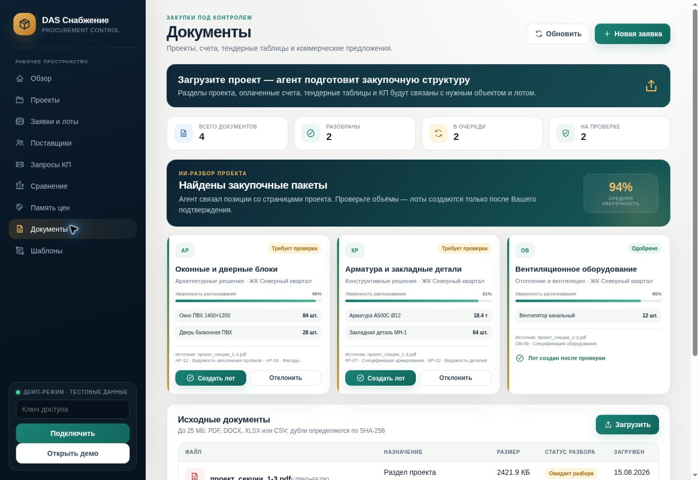</td>
  </tr>
  <tr>
    <td colspan="2"><b>10. Шаблоны</b><br><sub>Единый язык запросов для разных каналов, проектов и категорий закупки.</sub><br><br>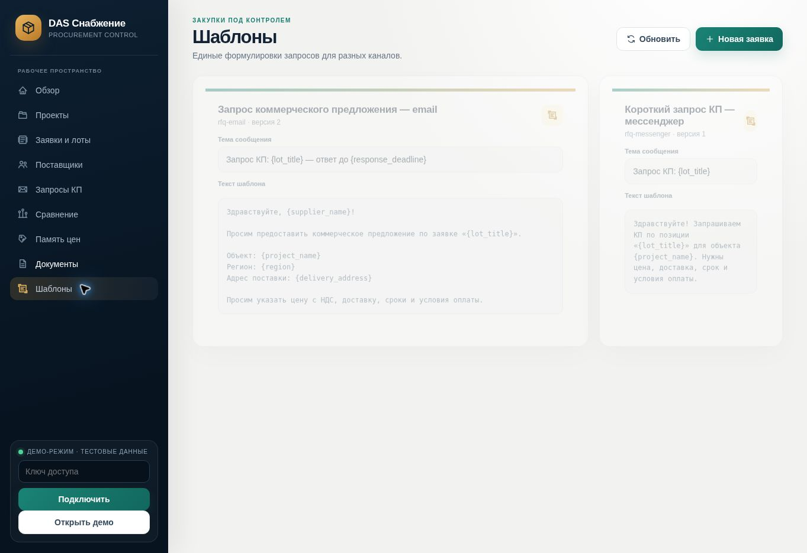</td>
  </tr>
</table>

## Сквозной процесс

```text
Проект / заявка
      ↓
AI-разбор разделов и ручная проверка объёмов
      ↓
Закупочный лот со спецификацией и адресом поставки
      ↓
Подбор своей базы + новые кандидаты по региону
      ↓
Персональные черновики запросов КП
      ↓
Одобрение сотрудником и контролируемая отправка
      ↓
Полученные предложения и уточнения
      ↓
Нормализация цены, доставки, срока и условий оплаты
      ↓
Сравнительная таблица + память фактически оплаченных цен
      ↓
Решение комиссии / руководителя
```

## Реализовано в версии 0.4.0

| Контур | Возможности |
|---|---|
| **Проекты** | объекты, регионы, адреса доставки, разделы и связанные лоты |
| **Лоты** | подробная спецификация, количество, единицы, сроки и валюта |
| **AI-разбор проекта** | предложения закупочных пакетов, доказательства, уверенность и очередь проверки |
| **Human review** | раздел и лот создаются транзакционно только после подтверждения сотрудником |
| **Поставщики** | реестр, категории, регионы, рейтинг, проверка и источник контакта |
| **Импорт** | предварительный просмотр и загрузка базы поставщиков из CSV/XLSX |
| **Запросы КП** | версионируемые шаблоны, персональные черновики и ручное одобрение |
| **Предложения** | регистрация КП, доставка, сроки, оплата, гарантия и соответствие |
| **Сравнение** | полная стоимость, рейтинг, дисквалификация и потенциал переговоров |
| **Память цен** | ориентир по подтверждённым оплаченным счетам с сопоставлением единиц и валюты |
| **Документы** | PDF/DOCX/XLSX/CSV до 25 МБ, SHA-256 защита от дублей, очередь разбора |
| **Контроль** | API-ключ, аудит действий, fail-closed проверки и режим `draft_only` |

## Почему это не обычный чат

- закупка живёт неделями и должна иметь понятные статусы;
- поставщики участвуют в разных проектах и категориях;
- каждое сообщение и изменение должны быть проверяемыми;
- КП требуют нормализации и сравнения одинаковых условий;
- проектные документы и цены должны быть изолированы по ролям;
- рекомендация модели должна быть отделена от решения компании.

## Правила безопасности

1. ИИ не выбирает победителя и не утверждает закупку.
2. Найденный в интернете поставщик не становится проверенным автоматически.
3. Сообщения создаются как черновики и требуют одобрения сотрудника.
4. Неполное или несоответствующее КП не участвует в рейтинге.
5. AI-извлечение не создаёт лот без human review.
6. Повторное подтверждение одного предложения блокируется.
7. Историческая цена учитывается только после подтверждения человеком.
8. Все ключевые решения фиксируются в журнале аудита.

Подробно: [архитектура и инварианты](docs/architecture.md).

## Быстрый просмотр без установки

Откройте [`procurement/static/index.html`](procurement/static/index.html) в браузере
и нажмите **«Открыть демо»**. Демо использует безопасные тестовые данные, не сохраняет
изменения и не отправляет сообщения.

## Локальный запуск

```bash
cp .env.example .env
# Укажите уникальный PROCUREMENT_API_KEY в .env
docker compose up --build
```

После запуска:

- кабинет: `http://127.0.0.1:9200/`;
- проверка: `http://127.0.0.1:9200/health`;
- OpenAPI: `http://127.0.0.1:9200/docs`.

```bash
curl http://127.0.0.1:9200/health
curl -H 'X-API-Key: change-me' http://127.0.0.1:9200/api/dashboard
```

Для production сервис должен публиковаться только через HTTPS reverse proxy,
корпоративную аутентификацию и серверное хранилище секретов.

### Единый вход из DAS

Интеграция не передаёт `PROCUREMENT_API_KEY` в браузер. Django DAS создаёт
подписанный launch-token на срок не более 120 секунд, а Procurement Agent
обменивает его на HttpOnly/SameSite session-cookie. Launch-token одноразовый:
его `jti` атомарно фиксируется в локальной БД.

Оба сервиса должны получать один случайный секрет длиной не менее 32 символов:

```text
PROCUREMENT_SSO_SECRET=<shared secret from server secret store>
PROCUREMENT_SSO_ISSUER=das
PROCUREMENT_SESSION_TTL_SECONDS=28800
```

В production cookie устанавливается с флагом `Secure`. API-ключ остаётся только
для внутренних server-to-server вызовов и аварийной диагностики; сохранять его
в `localStorage` запрещено.

## Импорт базы поставщиков

Поддерживаются `.csv` и `.xlsx`. Распознаются русские и английские заголовки:

```text
Поставщик | ИНН/БИН | Регион | Email | Телефон | Telegram | Категории | Рейтинг | Проверен
```

Сначала выполняется предварительная проверка без записи:

```bash
curl -H 'X-API-Key: change-me' \
  -F 'file=@suppliers.xlsx' \
  'http://127.0.0.1:9200/api/suppliers/import?commit=false'
```

После проверки используется тот же запрос с `commit=true`.

## Политика оценки КП

| Фактор | Вес |
|---|---:|
| Полная цена с доставкой | 60% |
| Срок поставки | 15% |
| Исторический рейтинг поставщика | 15% |
| Заполненные условия оплаты | 10% |

Рейтинг является объяснимой рекомендацией, а не автоматическим выбором победителя.

## Архитектура

```text
Веб-кабинет
    │
    ▼
FastAPI / Procurement Service ─────► SQLite (MVP) / PostgreSQL (production)
    │                                      │
    ├────► DAS AI / OCR                    ├── проекты и разделы
    ├────► Supplier Discovery              ├── поставщики и история цен
    ├────► Corporate Email                 ├── лоты, КП и сравнение
    └────► Messenger adapters              └── согласования и аудит
```

## Структура репозитория

```text
procurement/
├── app.py                 # FastAPI и HTTP API
├── service.py             # бизнес-правила закупки
├── db.py                  # схема и доступ к данным
├── models.py              # строгие входные модели
├── ranking.py             # объяснимое ранжирование КП
├── imports.py             # CSV/XLSX импорт
├── templates.py           # безопасный рендер шаблонов
└── static/                # единый веб-кабинет и визуальные материалы
tests/
└── test_procurement.py    # сервисные, защитные и UI-контракт тесты
docs/
└── architecture.md        # границы продукта и инварианты
```

## Следующие этапы

- [ ] подключить DAS AI/OCR к готовому API предложений закупки;
- [ ] разбирать оплаченные счета в подтверждаемую память цен;
- [ ] добавить корпоративную почту и приём вложений КП;
- [ ] искать новых поставщиков по категории и региону;
- [ ] проверять реквизиты и каналы связи до первого контакта;
- [ ] экспортировать сравнительную таблицу и протокол в XLSX/DOCX/PDF;
- [ ] перейти на PostgreSQL, объектное хранилище, очередь задач, SSO и RBAC;
- [ ] добавить метрики экономии, скорости тендера и конверсии ответов.

## Ключевые метрики продукта

- время от заявки до первой рассылки;
- доля поставщиков, приславших КП;
- экономия относительно подтверждённой исторической цены;
- количество ручных переносов данных;
- процент AI-позиций, подтверждённых без исправлений;
- доля тендеров с полным и проверяемым протоколом решения.

---

<div align="center">

**DAS Procurement Agent — управляемая закупка, а не непрозрачный автопилот.**

</div>
